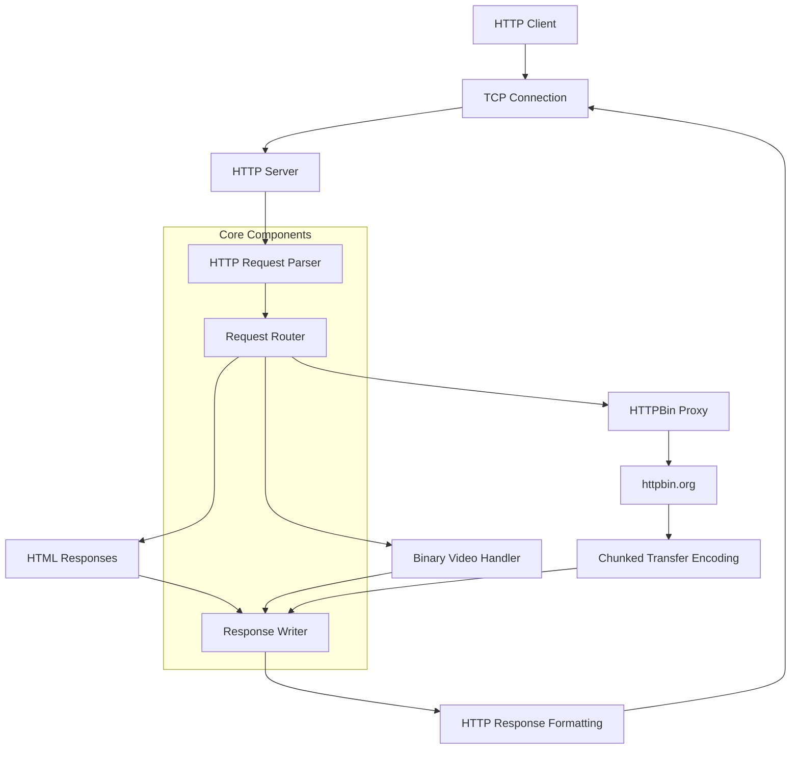

# HTTP-from-TCP: Building HTTP from the Ground Up

A **learning-focused HTTP server implementation** built entirely FROM SCRATCH on top of the TCP connection. This project demonstrates how HTTP works at the protocol level by parsing TCP connections, implementing HTTP message parsing, and building a complete web server with advanced features like chunked transfer encoding and binary data serving.

## 🎯 Why This Project?

Understanding HTTP is fundamental to web development, but most developers only interact with high-level HTTP libraries. This project peels back the abstraction layers to show:

- **How HTTP actually works** over TCP connections
- **Raw HTTP message parsing** without libraries
- **Protocol-level implementation** of features like chunked encoding
- **Binary data handling** in text-based protocols

## 🚀 Quick Start

```bash
# Clone the repository
git clone https://github.com/taham8875/http-from-tcp.git
cd http-from-tcp

# Run the server
go run ./cmd/httpserver

# Test it out!
curl http://localhost:42069/
curl http://localhost:42069/video
curl http://localhost:42069/httpbin/stream/100
```

Visit `http://localhost:42069` in your browser to see the server in action!

## 🏗️ Architecture Overview



## ✨ Key Features

### 🔧 Core HTTP Implementation

- **Raw TCP connection handling** with `net.Listen` and `net.Conn`
- **HTTP request parsing** from byte streams
- **HTTP response formatting** with proper headers and status codes
- **Flexible response writer** with state management

### 🌐 Advanced HTTP Features

- **Chunked Transfer Encoding** for streaming responses
- **HTTP Trailers** with SHA256 content hashing
- **Binary data serving** (videos, images, etc.)
- **Proxy functionality** to httpbin.org with real-time streaming

### 📁 Project Structure

```
├── cmd/httpserver/          # Main server application
├── internal/
│   ├── headers/            # HTTP header parsing and management
│   ├── request/            # HTTP request parsing
│   ├── response/           # HTTP response writing
│   └── server/             # TCP server implementation
├── assets/                 # Static assets (videos, etc.)
└── README.md
```

## 🎮 Available Endpoints

| Endpoint | Description | Response Type |
|----------|-------------|---------------|
| `GET /` | Default success page | HTML |
| `GET /yourproblem` | 400 Bad Request example | HTML |
| `GET /myproblem` | 500 Internal Server Error | HTML |
| `GET /video` | Streams a video file | Binary (video/mp4) |
| `GET /httpbin/*` | Proxies requests to httpbin.org | Chunked JSON |
